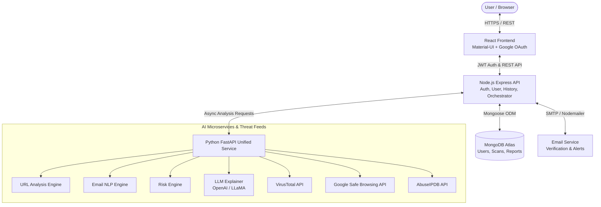

<div align="center">

# 🛡️ Phish-Guard

### Multi-Layered AI-Powered Phishing & Threat Intelligence Detection Platform

[](https://reactjs.org/)
[](https://nodejs.org/)
[](https://fastapi.tiangolo.com/)
[](https://www.mongodb.com/)
[](LICENSE)

*An enterprise-grade cybersecurity platform that identifies malicious URLs, deceptive emails, brand spoofing attacks, and social engineering tricks using combined machine learning, threat intelligence feeds, and LLM explainability.*

---

</div>

## 📑 Table of Contents

- [Overview](#-overview)
- [System Architecture](#-system-architecture)
- [Key Features](#-key-features)
- [Technology Stack](#-technology-stack)
- [Project Directory Structure](#-project-directory-structure)
- [Security & Detection Engines](#-security--detection-engines)
- [API Endpoints Reference](#-api-endpoints-reference)
- [Environment Configuration](#-environment-configuration)
- [Local Development & Setup](#-local-development--setup)
- [Deployment Guide (Vercel & Render)](#-deployment-guide-vercel--render)
- [Authentication Workflow](#-authentication-workflow)
- [Troubleshooting & FAQs](#-troubleshooting--faqs)

---

## 🌟 Overview

**Phish-Guard** is an intelligent security analysis system built to defend users against modern cyber threats. Traditional filters often fail to recognize targeted spear-phishing or newly registered look-alike domains. 

Phish-Guard solves this by deploying a **multi-layered defensive pipeline**:
1. **Lexical & Behavioral Heuristics**: Immediate detection of urgency words, suspicious URL structures, IP addresses in links, and credential-harvesting patterns.
2. **Brand Impersonation Engine**: Identifies homograph attacks and spoofed platforms (e.g., PayPal, Microsoft, Google, Netflix, Amazon, Apple, Chase).
3. **Global Threat Intelligence**: Cross-verifies indicators in real-time with **VirusTotal**, **Google Safe Browsing**, and **AbuseIPDB**.
4. **Explainable AI (LLM)**: Translates technical threat data into clear, human-understandable verdicts with risk scoring and mitigation guidance.

---

## 🏗️ System Architecture



---

## ✨ Key Features

- **🌐 Live URL & Domain Scanner**:
  - Analyzes protocols, IP-formatted hosts, subdomains, shortening services (`bit.ly`, `tinyurl.com`), and suspicious URL keywords.
  - Checks live domain reputation against global blacklists.

- **✉️ Email Social Engineering & Phishing Analysis**:
  - Detects high-pressure psychological manipulation ("Account suspended", "Urgent action required").
  - Uncovers hidden credential-harvesting triggers (password requests, banking inquiries).
  - Inspects email attachments and embedded suspicious hyperlinks.

- **🛡️ Brand Impersonation Protection**:
  - Detects when malicious senders spoof trusted brands to harvest credentials.

- **📊 Comprehensive Threat Dashboard & History**:
  - Real-time safety scores (0–100%).
  - Breakdown of detected indicators and threat severity levels (Safe, Low, Moderate, High, Critical).
  - Searchable audit log of past scans and simulation tests.

- **🔐 Robust Dual Authentication**:
  - **Local Auth**: Password hashing with `bcryptjs`, email verification token system via Nodemailer.
  - **Google OAuth 2.0**: Seamless Google Sign-In with server-side token validation via `google-auth-library`.

---

## 💻 Technology Stack

### Frontend
- **Framework**: [React 18](https://reactjs.org/) (Create React App)
- **UI Components & Icons**: [Material UI (MUI v7)](https://mui.com/) & Material Icons
- **Authentication**: [@react-oauth/google](https://www.npmjs.com/package/@react-oauth/google)
- **Routing**: [React Router DOM v7](https://reactrouter.com/)
- **HTTP Client**: [Axios](https://axios-http.com/) with centralized interceptors and timeout protections
- **Design**: Cyber-dark aesthetic, glassmorphic paper panels, green neon accent tokens (`#2a7a55`, `#4ade80`).

### Backend (Node.js API)
- **Runtime**: Node.js & [Express 5](https://expressjs.com/)
- **Database & ODM**: [MongoDB Atlas](https://www.mongodb.com/) via [Mongoose 8](https://mongoosejs.com/)
- **Security**: `jsonwebtoken` (JWT), `bcryptjs`, `cors`
- **OAuth Verification**: `google-auth-library` (verifyIdToken)
- **Mailing**: `nodemailer` with Gmail SMTP transport

### AI & Threat Microservice (Python)
- **Framework**: [FastAPI](https://fastapi.tiangolo.com/) with [Uvicorn](https://www.uvicorn.org/)
- **Data Validation**: [Pydantic v2](https://docs.pydantic.dev/)
- **LLM Integrations**: OpenAI API / Local LLaMA2 (Ollama)
- **Threat Feeds**: VirusTotal v3 API, Google Safe Browsing Lookup v4, AbuseIPDB v2 API

---

## 📁 Project Directory Structure

```text
Phish-Guard/
├── backend/
│   ├── ai/                          # Python AI Microservices
│   │   ├── email_service/           # NLP email classification engine
│   │   ├── url_service/             # Lexical URL inspection service
│   │   ├── threat_intel/            # VirusTotal, Google Safe Browsing, AbuseIPDB
│   │   ├── llm_service/             # OpenAI & LLaMA explainability generator
│   │   ├── risk_engine/             # Multi-factor score calculator
│   │   ├── requirements.txt         # Python dependencies
│   │   ├── start_all_services.py    # Local multi-port microservice runner
│   │   └── unified_service.py       # Single-port production FastAPI app (Render)
│   ├── config/                      # Constants, AI configs, and env loaders
│   ├── controllers/                 # Express controllers (auth, scan, reports)
│   ├── middleware/                  # JWT auth middleware & access control
│   ├── models/                      # Mongoose schemas (User, Email, ScanResult, ThreatReport)
│   ├── routes/                      # Express route definitions
│   ├── services/                    # Internal business logic and third-party API clients
│   ├── utils/                       # Token helpers and utility functions
│   ├── server.js                    # Express application entrypoint
│   └── package.json                 # Node.js dependencies & scripts
│
├── frontend/
│   ├── public/                      # Static assets, favicon, HTML shell
│   ├── src/
│   │   ├── api/                     # Axios API clients
│   │   ├── components/              # UI components (Navbar, Login, Register, ThreatIntelCard)
│   │   ├── context/                 # AuthContext (JWT, user state, Google login)
│   │   ├── hooks/                   # Custom React hooks (useAuth, useScan)
│   │   ├── pages/                   # Views (LandingPage, Dashboard, Analyze, History, VerifyEmail)
│   │   ├── utils/                   # Theme configuration
│   │   ├── App.js                   # Client-side router & route protection
│   │   ├── index.js                 # React root & GoogleOAuthProvider configuration
│   │   └── index.css                # Global typography and animations
│   ├── .env.production              # Production environment URLs for Vercel
│   └── package.json                 # Frontend dependencies & build scripts
│
├── render.yaml                      # Infrastructure-as-Code for Render cloud deployment
└── README.md                        # Master Project Documentation
```

---

## 🔍 Security & Detection Engines

```
[ Raw Target Input (Email or URL) ]
                │
                ├────────────────────────────────────────┐
                ▼                                        ▼
    ┌───────────────────────┐                ┌───────────────────────┐
    │   Lexical Analysis    │                │  Brand Spoofing Check │
    │  - Urgency keywords   │                │  - Look-alike domains │
    │  - Hex / IP in URLs   │                │  - Display name vs    │
    │  - Form harvesting    │                │    origin domain      │
    └───────────┬───────────┘                └───────────┬───────────┘
                │                                        │
                └───────────────────┬────────────────────┘
                                    ▼
                    ┌───────────────────────────────┐
                    │  Threat Intel Live Query      │
                    │  - VirusTotal reputation      │
                    │  - Google Safe Browsing v4    │
                    │  - AbuseIPDB abuse confidence │
                    └───────────────┬───────────────┘
                                    ▼
                    ┌───────────────────────────────┐
                    │      Composite Risk Engine    │
                    │   Safety Score: 0 (Danger)    │
                    │              to 100 (Safe)    │
                    └───────────────┬───────────────┘
                                    ▼
                    ┌───────────────────────────────┐
                    │    Generative LLM Explainer   │
                    │   Plain-English summary and   │
                    │   recommended remediation    │
                    └───────────────────────────────┘
```

---

## 📡 API Endpoints Reference

### Authentication (`/api/auth`)
| Method | Endpoint | Description | Auth Required |
|:-------|:---------|:------------|:--------------|
| `POST` | `/api/auth/register` | Register new account & trigger verification email | No |
| `POST` | `/api/auth/login` | Authenticate with email & password | No |
| `POST` | `/api/auth/google` | Sign in / Sign up with Google OAuth ID token | No |
| `GET`  | `/api/auth/verify/:token` | Verify user email address | No |
| `POST` | `/api/auth/resend-verification` | Resend verification email | No |
| `POST` | `/api/auth/logout` | Invalidate current session | Yes |

### Threat Analysis & Scans (`/api/scan` & `/api/analyze`)
| Method | Endpoint | Description | Auth Required |
|:-------|:---------|:------------|:--------------|
| `POST` | `/api/analyze` | Quick heuristic email analysis | No |
| `POST` | `/api/scan/url` | In-depth URL scan with Threat Intel & Risk Engine | Yes |
| `POST` | `/api/scan/email` | Full email scan with attachment & indicator inspection | Yes |
| `GET`  | `/api/scan/history` | Retrieve user scan history | Yes |
| `GET`  | `/api/scan/:id` | Get specific scan result details | Yes |

### Health & Monitoring
| Method | Endpoint | Description |
|:-------|:---------|:------------|
| `GET`  | `/api/health` | Backend service health and UTC timestamp |

---

## ⚙️ Environment Configuration

### 1. Backend (`backend/.env`)
Create a `.env` file in the `backend/` directory:

```env
# Server
PORT=5000
NODE_ENV=development

# Database
MONGODB_URI=mongodb+srv://<username>:<password>@cluster.mongodb.net/phishguard?retryWrites=true&w=majority

# JWT Authentication
JWT_SECRET=super_secret_jwt_random_key_here
JWT_EXPIRE=7d

# Google OAuth (Must match frontend Client ID)
GOOGLE_CLIENT_ID=your_google_client_id.apps.googleusercontent.com
GOOGLE_CLIENT_SECRET=GOCSPX-your_google_client_secret

# Email Service (Nodemailer Gmail SMTP)
EMAIL_SERVICE_HOST=smtp.gmail.com
EMAIL_SERVICE_PORT=587
EMAIL_USER=your_email@gmail.com
EMAIL_PASS=your_gmail_app_password

# Allowed Frontend Origins (comma-separated)
FRONTEND_URL=http://localhost:3000,https://phish-guard-three-iota.vercel.app

# AI Microservices (Local or Render endpoints)
EMAIL_SERVICE_URL=http://localhost:8000
URL_SERVICE_URL=http://localhost:8000
THREAT_INTEL_URL=http://localhost:8000
LLM_SERVICE_URL=http://localhost:8000
RISK_ENGINE_URL=http://localhost:8000

# External API Keys (Optional)
VIRUSTOTAL_API_KEY=your_virustotal_api_key
GOOGLE_SAFE_BROWSING_API_KEY=your_google_safe_browsing_key
ABUSEIPDB_API_KEY=your_abuseipdb_api_key
OPENAI_API_KEY=sk-your_openai_api_key
```

### 2. Frontend (`frontend/.env` / `frontend/.env.production`)
Create a `.env` file in `frontend/`:

```env
# Backend API Base URL
REACT_APP_API_URL=http://localhost:5000

# AI Service Base URL
REACT_APP_AI_URL=http://localhost:8000

# Google OAuth Client ID (from Google Cloud Console)
REACT_APP_GOOGLE_CLIENT_ID=your_google_client_id.apps.googleusercontent.com
```

---

## 🚀 Local Development & Setup

### Prerequisites
- **Node.js**: v18.0.0 or higher
- **Python**: v3.9 or higher
- **MongoDB**: Local MongoDB instance or free [MongoDB Atlas](https://www.mongodb.com/) cluster

### Step 1: Clone Repository
```bash
git clone https://github.com/mguruprasath416/Phish-Guard.git
cd Phish-Guard
```

### Step 2: Setup Python AI Unified Service
```bash
cd backend/ai
python -m venv venv

# Windows
venv\Scripts\activate
# macOS/Linux
source venv/bin/activate

pip install -r requirements.txt
uvicorn unified_service:app --host 0.0.0.0 --port 8000 --reload
```

### Step 3: Setup Node.js Backend
In a new terminal:
```bash
cd backend
npm install
npm run dev
```
*The backend starts at `http://localhost:5000`.*

### Step 4: Setup React Frontend
In a new terminal:
```bash
cd frontend
npm install
npm start
```
*The frontend opens at `http://localhost:3000`.*

---

## ☁️ Deployment Guide (Vercel & Render)

This application is architected for cloud deployment:

### 1. Frontend on Vercel
1. Connect your GitHub repository to [Vercel](https://vercel.com).
2. Set the **Root Directory** to `frontend`.
3. Add the Environment Variables:
   - `REACT_APP_API_URL`: Your deployed Render backend URL (e.g., `https://phishguard-backend-i4j6.onrender.com`)
   - `REACT_APP_AI_URL`: Your deployed Render AI URL (e.g., `https://phishguard-ai-s9ee.onrender.com`)
   - `REACT_APP_GOOGLE_CLIENT_ID`: Your Google OAuth Client ID.
4. Deploy.

### 2. Backend & AI on Render
The repository includes a ready-to-deploy [`render.yaml`](render.yaml) specification:
1. Log into [Render](https://render.com) and create a **New Blueprint Instance**.
2. Select the repository. Render will automatically spin up:
   - **`phishguard-ai`**: Python FastAPI Web Service (`uvicorn unified_service:app`).
   - **`phishguard-backend`**: Node.js Express Web Service (`node server.js`).
3. Set your secret environment variables in the Render Dashboard:
   - `MONGODB_URI`
   - `JWT_SECRET`
   - `GOOGLE_CLIENT_ID` & `GOOGLE_CLIENT_SECRET`
   - `EMAIL_USER` & `EMAIL_PASS`
   - `FRONTEND_URL` (Set to your Vercel URL: `https://phish-guard-three-iota.vercel.app`)

---

## 🔑 Authentication Workflow

### Google OAuth Flow
```
User clicks "Continue with Google"
  │
  ▼
Google OAuth Popup (accounts.google.com)
  │ (User grants consent)
  ▼
Client receives Google ID Token (JWT)
  │
  ▼
POST /api/auth/google  { idToken }
  │
  ├─ Backend validates token signature via Google Auth Library
  ├─ Finds or creates User document in MongoDB
  └─ Issues Phish-Guard JWT token to client
  │
  ▼
Client stores JWT in localStorage & redirects to /dashboard
```

---

## ❓ Troubleshooting & FAQs

#### 1. Why does "Continue with Google" stay stuck on "SIGNING IN..."?
- **Render Free Tier Sleep Mode**: Free-tier web services on Render go to sleep after 15 minutes of inactivity. The first wake-up request takes ~50 seconds.
- **Missing `GOOGLE_CLIENT_ID` or `MONGODB_URI`**: If MongoDB cannot connect, Express exits with `process.exit(1)`, causing the request to time out.
- **MongoDB Atlas IP Whitelisting**: Ensure `0.0.0.0/0` is added under MongoDB Atlas -> *Network Access*.

#### 2. Google OAuth shows `origin_mismatch` or `Error 400`
- Open [Google Cloud Console](https://console.cloud.google.com/) -> **APIs & Services** -> **Credentials**.
- Edit your OAuth 2.0 Client ID.
- In **Authorized JavaScript Origins**, add:
  - `http://localhost:3000`
  - `https://phish-guard-three-iota.vercel.app` (your production URL without a trailing slash).

#### 3. CORS errors in browser console
- In your Render Backend settings, verify `FRONTEND_URL` includes your exact Vercel domain. Phish-Guard already contains wildcard regex support for all Vercel preview deployments.

---

## 🛡️ License

This project is licensed under the **ISC License**.

---

<div align="center">
Developed with ❤️ for a safer web.
</div>
